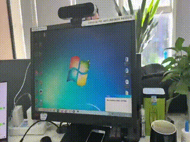

## 概述
Windows 登录插件 (类似Windows hello，但是对摄像头没有用要求)，安装后，可直接使用人脸识别，指纹鼠标/键盘等方式登录Windows.


演示如下：





## 支持系统版本
|系统版本|支持情况|备注|
|:---:|:---:|:---:|
|Windows XP|不支持| - |
|Windows Vista|不支持| - |
|Windows XP|不支持| - |
|Windows XP|不支持| - |
|Windows XP|不支持| - |
|Windows XP|不支持| - |
|Windows XP|不支持| - |
|Windows XP|不支持| - |
|Windows XP|不支持| - |


## 联系我
有任何疑问或者问题，可通过如下方式联系我

```
`Wechat Number:` esand_info </br>
`QQ Number:` 3626921591 </br>
`Phone Number:` +8613691664797</br>
`Email:` reid.li@foxmail.com</br>
`Telegram:` [@R90000000](https://t.me/R90000000)</br>
```


Wechat QR CODE :


